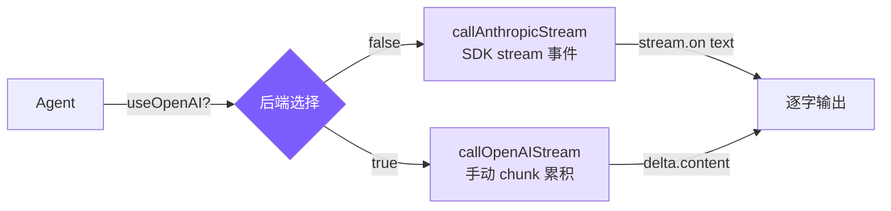

# 4. 流式输出与双后端

## 本章目标

实现流式输出让回答逐字显示，并支持 Anthropic 和 OpenAI 两套 API 后端。



## Claude Code 怎么做的

### 为什么需要流式输出？

模型生成速度大约每秒 30-80 个 token，稍长的回答需要 10-30 秒。用户面对空白等待的容忍极限约 2-3 秒。流式输出让第一个字在几百毫秒内出现，把"等待 30 秒"变成"看着内容逐渐写出来"——主观等待感接近零，并且用户能在方向错误时提前中断。

底层用的是 SSE（Server-Sent Events）：服务端用一条持久 HTTP 连接持续推送 `data:` 行，每几个 token 就推一个 `content_block_delta` 事件。比 WebSocket 简单，对 LLM 应用来说单向推送已经够用。

### 流式处理与并行工具执行

Claude Code 的一个关键优化：`StreamingToolExecutor` 在模型还在生成后续内容时，已解析完成的 tool_use block 就立即开始执行。串行方式下工具执行只能等 API 完整响应后开始；流式并行下，第一个 tool_use 解析完毕时直接分发，不等第二个。

在典型的 5-30 秒 API 流窗口内，文件读取（< 100ms）几乎能全部覆盖进去——流结束时工具结果往往已全部就绪。

### 错误重试

不是所有错误都值得重试：429/503/529 和网络瞬断（ECONNRESET）可以重试；400/401/404 反映代码或配置问题，重试没有意义。

指数退避（而不是固定间隔）的原因：服务过载时，大量客户端固定 1 秒后同时重试会形成"重试风暴"，反而加剧过载。指数退避让间隔逐轮翻倍（1s → 2s → 4s），加上随机抖动打破多客户端同步，是标准的分布式容错做法。

## 我们的实现

### Anthropic 后端：SDK 内置 stream

<!-- tabs:start -->
#### **TypeScript**
```typescript
// agent.ts — callAnthropicStream

private async callAnthropicStream(): Promise<Anthropic.Message> {
  return withRetry(async (signal) => {
    const createParams: any = {
      model: this.model,
      max_tokens: this.thinkingMode !== "disabled" ? maxOutput : 16384,
      system: this.systemPrompt,
      tools: toolDefinitions,
      messages: this.anthropicMessages,
    };

    if (this.thinkingMode === "enabled") {
      createParams.thinking = { type: "enabled", budget_tokens: maxOutput - 1 };
    } else if (this.thinkingMode === "adaptive") {
      createParams.thinking = { type: "enabled", budget_tokens: 10000 };
    }

    const stream = this.anthropicClient!.messages.stream(createParams, { signal });

    let firstText = true;
    stream.on("text", (text) => {
      if (firstText) { printAssistantText("\n"); firstText = false; }
      printAssistantText(text);
    });

    const finalMessage = await stream.finalMessage();

    // thinking blocks 不存入历史，避免浪费上下文窗口
    if (this.thinkingMode !== "disabled") {
      finalMessage.content = finalMessage.content.filter(
        (block: any) => block.type !== "thinking"
      );
    }

    return finalMessage;
  }, this.abortController?.signal);
}
```
#### **Python**
```python
# agent.py — _call_anthropic_stream

async def _call_anthropic_stream(self):
    async def _do():
        create_params: dict[str, Any] = {
            "model": self.model,
            "max_tokens": _get_max_output_tokens(self.model) if self._thinking_mode != "disabled" else 16384,
            "system": self._system_prompt,
            "tools": self.tools,
            "messages": self._anthropic_messages,
        }

        if self._thinking_mode in ("adaptive", "enabled"):
            create_params["thinking"] = {"type": "enabled", "budget_tokens": _get_max_output_tokens(self.model) - 1}

        first_text = True
        async with self._anthropic_client.messages.stream(**create_params) as stream:
            async for event in stream:
                if hasattr(event, 'type') and event.type == "content_block_delta":
                    delta = event.delta
                    if hasattr(delta, 'text'):
                        if first_text:
                            stop_spinner()
                            self._emit_text("\n")
                            first_text = False
                        self._emit_text(delta.text)

            final_message = await stream.get_final_message()

        final_message.content = [b for b in final_message.content if b.type != "thinking"]
        return final_message

    return await _with_retry(_do)
```
<!-- tabs:end -->

Anthropic SDK 封装了全部 SSE 解析细节：`stream.on("text")` 直接给文本增量，`stream.finalMessage()` 返回和非流式完全一样的 `Message` 对象。`{ signal }` 把 AbortController 传进去，Ctrl+C 可以中断网络请求。

### OpenAI 兼容后端：手动 chunk 累积

OpenAI streaming 的 tool_calls 参数是分 chunk 到达的，需要手动累积重建。

<!-- tabs:start -->
#### **TypeScript**
```typescript
// agent.ts — callOpenAIStream

private async callOpenAIStream(): Promise<OpenAI.ChatCompletion> {
  return withRetry(async (signal) => {
    const stream = await this.openaiClient!.chat.completions.create({
      model: this.model,
      max_tokens: 16384,
      tools: toOpenAITools(),
      messages: this.openaiMessages,
      stream: true,
      stream_options: { include_usage: true },
    }, { signal });

    let content = "";
    let firstText = true;
    const toolCalls: Map<number, { id: string; name: string; arguments: string }> = new Map();
    let finishReason = "";
    let usage: { prompt_tokens: number; completion_tokens: number } | undefined;

    for await (const chunk of stream) {
      const delta = chunk.choices[0]?.delta;

      if (chunk.usage) {
        usage = { prompt_tokens: chunk.usage.prompt_tokens, completion_tokens: chunk.usage.completion_tokens };
      }

      if (!delta) continue;

      if (delta.content) {
        if (firstText) { printAssistantText("\n"); firstText = false; }
        printAssistantText(delta.content);
        content += delta.content;
      }

      // tool_calls 参数分片到达，按 index 累积
      if (delta.tool_calls) {
        for (const tc of delta.tool_calls) {
          const existing = toolCalls.get(tc.index);
          if (existing) {
            if (tc.function?.arguments) existing.arguments += tc.function.arguments;
          } else {
            toolCalls.set(tc.index, {
              id: tc.id || "",
              name: tc.function?.name || "",
              arguments: tc.function?.arguments || "",
            });
          }
        }
      }

      if (chunk.choices[0]?.finish_reason) finishReason = chunk.choices[0].finish_reason;
    }

    const assembledToolCalls = toolCalls.size > 0
      ? Array.from(toolCalls.entries())
          .sort(([a], [b]) => a - b)
          .map(([_, tc]) => ({
            id: tc.id, type: "function" as const,
            function: { name: tc.name, arguments: tc.arguments },
          }))
      : undefined;

    return {
      id: "stream", object: "chat.completion", created: Date.now(), model: this.model,
      choices: [{
        index: 0,
        message: { role: "assistant" as const, content: content || null, tool_calls: assembledToolCalls, refusal: null },
        finish_reason: finishReason || "stop", logprobs: null,
      }],
      usage: usage || { prompt_tokens: 0, completion_tokens: 0, total_tokens: 0 },
    } as OpenAI.ChatCompletion;
  }, this.abortController?.signal);
}
```
#### **Python**
```python
# agent.py — _call_openai_stream

async def _call_openai_stream(self) -> dict:
    async def _do():
        stream = await self._openai_client.chat.completions.create(
            model=self.model,
            max_tokens=16384,
            tools=_to_openai_tools(self.tools),
            messages=self._openai_messages,
            stream=True,
            stream_options={"include_usage": True},
        )

        content = ""
        first_text = True
        tool_calls: dict[int, dict] = {}
        finish_reason = ""
        usage = None

        async for chunk in stream:
            if chunk.usage:
                usage = {"prompt_tokens": chunk.usage.prompt_tokens, "completion_tokens": chunk.usage.completion_tokens}

            if not chunk.choices:
                continue
            delta = chunk.choices[0].delta

            if delta and delta.content:
                if first_text:
                    stop_spinner()
                    self._emit_text("\n")
                    first_text = False
                self._emit_text(delta.content)
                content += delta.content

            if delta and delta.tool_calls:
                for tc in delta.tool_calls:
                    existing = tool_calls.get(tc.index)
                    if existing:
                        if tc.function and tc.function.arguments:
                            existing["arguments"] += tc.function.arguments
                    else:
                        tool_calls[tc.index] = {
                            "id": tc.id or "",
                            "name": (tc.function.name if tc.function else "") or "",
                            "arguments": (tc.function.arguments if tc.function else "") or "",
                        }

            if chunk.choices[0].finish_reason:
                finish_reason = chunk.choices[0].finish_reason

        assembled = [
            {"id": tc["id"], "type": "function", "function": {"name": tc["name"], "arguments": tc["arguments"]}}
            for _, tc in sorted(tool_calls.items())
        ] if tool_calls else None

        return {
            "choices": [{"message": {"role": "assistant", "content": content or None, "tool_calls": assembled},
                         "finish_reason": finish_reason or "stop"}],
            "usage": usage or {"prompt_tokens": 0, "completion_tokens": 0},
        }

    return await _with_retry(_do)
```
<!-- tabs:end -->

OpenAI tool_calls 的 `id` 和 `name` 只在第一个 chunk 出现，后续 chunk 只有 `arguments` 的增量片段。多个 tool_call 的 chunk 会交错到达，用 `index` 字段区分，累积结束后才能 `JSON.parse()`。

### 工具格式转换

两个 API 的工具定义几乎相同，只是字段名不一样：

<!-- tabs:start -->
#### **TypeScript**
```typescript
function toOpenAITools(): OpenAI.ChatCompletionTool[] {
  return toolDefinitions.map((t) => ({
    type: "function" as const,
    function: { name: t.name, description: t.description, parameters: t.input_schema as Record<string, unknown> },
  }));
}
```
#### **Python**
```python
def _to_openai_tools(tools: list[ToolDef]) -> list[dict]:
    return [{"type": "function", "function": {"name": t["name"], "description": t["description"], "parameters": t["input_schema"]}} for t in tools]
```
<!-- tabs:end -->

Anthropic 用 `input_schema`，OpenAI 用 `parameters`，内容完全一样。

### 重试机制

<!-- tabs:start -->
#### **TypeScript**
```typescript
function isRetryable(error: any): boolean {
  const status = error?.status || error?.statusCode;
  if ([429, 503, 529].includes(status)) return true;
  if (error?.code === "ECONNRESET" || error?.code === "ETIMEDOUT") return true;
  if (error?.message?.includes("overloaded")) return true;
  return false;
}

async function withRetry<T>(
  fn: (signal?: AbortSignal) => Promise<T>,
  signal?: AbortSignal,
  maxRetries = 3
): Promise<T> {
  for (let attempt = 0; ; attempt++) {
    try {
      return await fn(signal);
    } catch (error: any) {
      if (signal?.aborted) throw error;
      if (attempt >= maxRetries || !isRetryable(error)) throw error;
      const delay = Math.min(1000 * Math.pow(2, attempt), 30000) + Math.random() * 1000;
      const reason = error?.status ? `HTTP ${error.status}` : error?.code || "network error";
      printRetry(attempt + 1, maxRetries, reason);
      await new Promise((r) => setTimeout(r, delay));
    }
  }
}
```
#### **Python**
```python
def _is_retryable(error: Exception) -> bool:
    status = getattr(error, "status_code", None) or getattr(error, "status", None)
    if status in (429, 503, 529):
        return True
    msg = str(error)
    if "overloaded" in msg or "ECONNRESET" in msg or "ETIMEDOUT" in msg:
        return True
    return False

async def _with_retry(fn, max_retries: int = 3):
    for attempt in range(max_retries + 1):
        try:
            return await fn()
        except Exception as error:
            if attempt >= max_retries or not _is_retryable(error):
                raise
            delay = min(1000 * (2 ** attempt), 30000) / 1000 + (hash(str(time.time())) % 1000) / 1000
            reason = str(getattr(error, "status_code", "")) or str(error)[:60]
            print_retry(attempt + 1, max_retries, reason)
            await asyncio.sleep(delay)
```
<!-- tabs:end -->

延迟公式 `min(1000 * 2^attempt, 30000) + random(0, 1000)`：指数部分控制退避速度，30 秒上限防止等待过久，随机抖动防止多个客户端同步重试形成"重试风暴"。

### Extended Thinking

Extended Thinking 让模型在输出前有一个私有"草稿纸"做推理规划，对需要多步决策的 coding 任务有明显帮助。

三种模式：
- **adaptive**：claude-4.x 模型自动开启，budget 10000 tokens，模型自行决定是否使用
- **enabled**：`--thinking` flag 显式开启，budget 最大化
- **disabled**：不支持 thinking 的模型（Claude 3.x 及 OpenAI）

<!-- tabs:start -->
#### **TypeScript**
```typescript
function resolveThinkingMode(model: string, thinkingFlag: boolean): "adaptive" | "enabled" | "disabled" {
  if (!modelSupportsThinking(model)) return "disabled";
  if (thinkingFlag) return "enabled";
  if (modelSupportsAdaptiveThinking(model)) return "adaptive";
  return "disabled";
}

// 构造请求参数
if (this.thinkingMode === "enabled") {
  createParams.thinking = { type: "enabled", budget_tokens: maxOutput - 1 };
} else if (this.thinkingMode === "adaptive") {
  createParams.thinking = { type: "enabled", budget_tokens: 10000 };
}

// 过滤 thinking blocks，不存入历史
finalMessage.content = finalMessage.content.filter((block: any) => block.type !== "thinking");
```
#### **Python**
```python
def _resolve_thinking_mode(self) -> str:
    if not self.thinking or not _model_supports_thinking(self.model):
        return "disabled"
    if _model_supports_adaptive_thinking(self.model):
        return "adaptive"
    return "enabled"

# 构造请求参数
if self._thinking_mode in ("adaptive", "enabled"):
    create_params["thinking"] = {"type": "enabled", "budget_tokens": max_output - 1}

# 过滤 thinking blocks，不存入历史
final_message.content = [b for b in final_message.content if b.type != "thinking"]
```
<!-- tabs:end -->

thinking blocks 可能长达数千 token，对后续对话没有参考价值，过滤掉是避免上下文窗口被无效内容占满的直接手段。

## 简化对比

| 维度 | Claude Code | mini-claude |
|------|------------|-------------|
| **后端支持** | 仅 Anthropic | Anthropic + OpenAI 兼容 |
| **重试策略** | 类似指数退避 | 指数退避 + 随机抖动 |
| **Thinking 处理** | 深度集成，独立展示与折叠 | 基础支持，过滤 thinking blocks |

---

> **下一章**：agent 能操作文件和执行命令了，但我们需要防止它做危险的事——删除文件、执行 `rm -rf`、push 到 main 分支。
