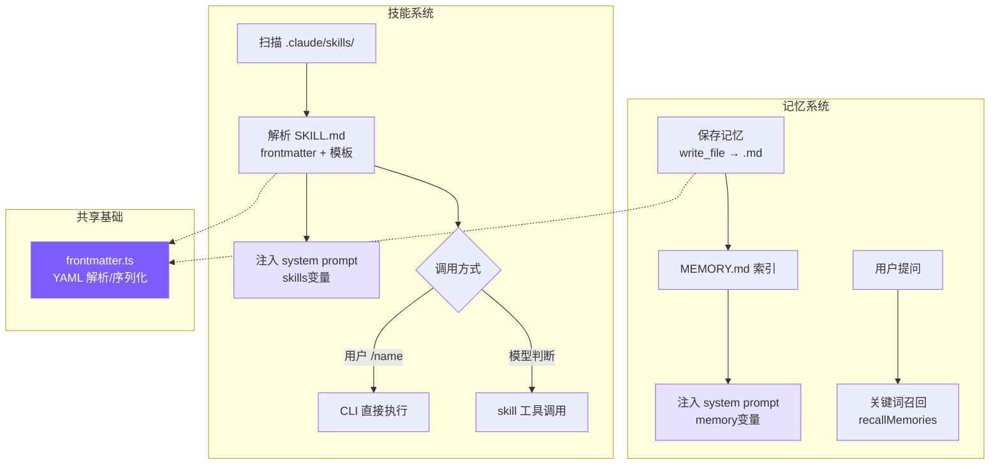
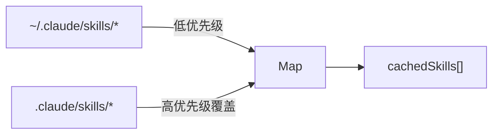
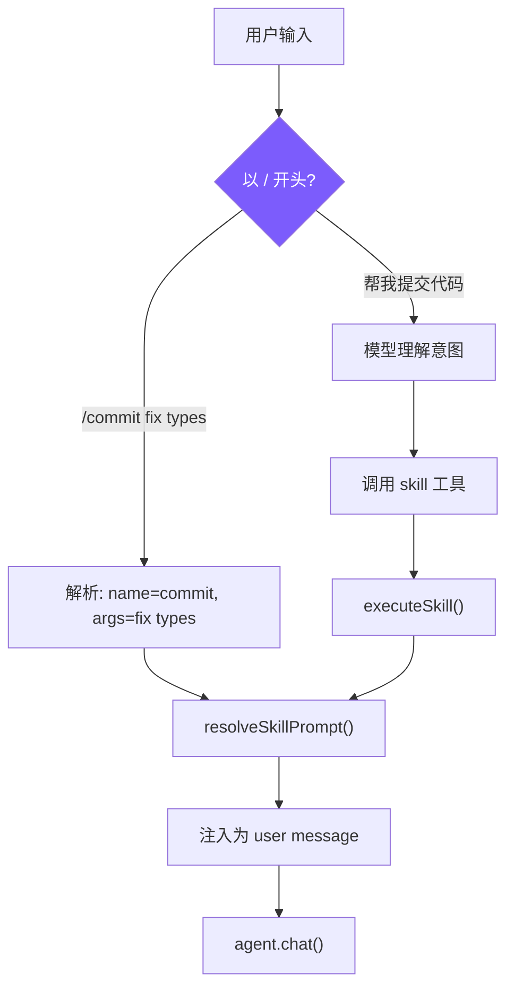

# 8. 记忆系统与技能系统

## 本章目标

实现两个跨会话能力：记忆系统让 Agent 在多次对话间保持对用户和项目的认知；技能系统让重复性 AI 工作流模板化，像 Shell 脚本一样即装即用。两者共享同一套 Frontmatter 元数据格式，并通过 system prompt 注入让模型知道如何使用它们。



---

## 记忆系统

### Claude Code 怎么做的

Claude Code 记忆系统的核心约束只有一条：**只记忆不可从当前项目状态推导的信息**。代码模式、架构、文件路径、git 历史、正在进行的调试——这些读代码和 `git log` 就能获得，记忆中的版本只会制造漂移。连用户明确要求保存的信息也不例外——如果用户说"记住这个 PR 列表"，Agent 应该追问：列表中有什么是不可推导的？某个截止日期？某个意外发现？

记忆分四种类型：

| 类型 | 记什么 | 触发时机 |
|------|--------|---------|
| **user** | 用户身份、偏好、知识背景 | 了解到用户角色/偏好时 |
| **feedback** | 对 Agent 行为的纠正**和肯定** | 用户纠正或肯定某个行为时 |
| **project** | 项目进展、决策、截止日期 | 了解到项目动态时 |
| **reference** | 外部系统的定位信息 | 了解到外部系统位置时 |

封闭分类法而非自由标签——防止标签膨胀导致召回时的模糊匹配。

`feedback` 类型有个细节：不只记录纠正，也记录用户的肯定。原因很实际：只记录"错误"会让模型避免重蹈覆辙，但也可能无意间放弃用户已经验证过的好做法。这两种类型还要求正文包含 `Why` 和 `How to apply`——因为知道"为什么"才能判断边界情况，盲目执行规则往往适得其反。

`project` 类型有个具体要求：相对日期必须转为绝对日期。"周四之后合并冻结"→"2026-03-05 后合并冻结"。记忆可能在几周后被读取，"周四"到时已毫无意义。

**MEMORY.md 是索引不是容器。** 它每次会话都完整加载到 system prompt，所以必须紧凑——每条一行链接，实际内容按需读取。设有 200 行/25KB 双重截断，超出时追加提示"keep index entries to one line under ~200 chars"。错误消息包含修复指引，这是贯穿整个系统的设计习惯。

**召回机制**用 `sideQuery` 调 Sonnet 做语义匹配，而非关键词搜索。用户问"部署流程"时，语义匹配能找到标题为"CI/CD 注意事项"的记忆，关键词匹配则不行。召回在模型开始生成响应的同时异步执行（`pendingMemoryPrefetch`），对用户而言延迟近乎为零。每次最多返回 5 条，上下文成本可控。

### 我们的实现

#### 存储结构

```
~/.mini-claude/projects/{sha256-hash}/memory/
├── MEMORY.md                          # 索引文件
├── user_prefers_concise_output.md
├── feedback_no_summary_at_end.md
├── project_auth_migration_q2.md
└── reference_ci_dashboard_url.md
```

路径中的哈希是 `process.cwd()` 的 sha256 前 16 位——同一项目目录始终映射到同一记忆空间。

#### 记忆文件格式

```markdown
---
name: 不要在回复末尾总结
description: 用户明确要求省略总结段落
type: feedback
---
用户说"不要在响应末尾总结"，因为他们能自己看 diff 和代码变更。

**Why:** 用户觉得总结浪费时间，更喜欢直接给出结果。
**How to apply:** 完成任务后直接结束，不要加 "总结" 或 "以上是..." 段落。
```

#### Frontmatter 解析（共享模块）

记忆和技能都要解析 YAML frontmatter，抽出 `frontmatter.ts`：

<!-- tabs:start -->
#### **TypeScript**
```typescript
// frontmatter.ts

export function parseFrontmatter(content: string): FrontmatterResult {
  const lines = content.split("\n");
  if (lines[0]?.trim() !== "---") return { meta: {}, body: content };

  let endIdx = -1;
  for (let i = 1; i < lines.length; i++) {
    if (lines[i].trim() === "---") { endIdx = i; break; }
  }
  if (endIdx === -1) return { meta: {}, body: content };

  const meta: Record<string, string> = {};
  for (let i = 1; i < endIdx; i++) {
    const colonIdx = lines[i].indexOf(":");
    if (colonIdx === -1) continue;
    const key = lines[i].slice(0, colonIdx).trim();
    const value = lines[i].slice(colonIdx + 1).trim();
    if (key) meta[key] = value;
  }

  const body = lines.slice(endIdx + 1).join("\n").trim();
  return { meta, body };
}
```
#### **Python**
```python
# frontmatter.py

@dataclass
class FrontmatterResult:
    meta: dict[str, str] = field(default_factory=dict)
    body: str = ""


def parse_frontmatter(content: str) -> FrontmatterResult:
    lines = content.split("\n")
    if not lines or lines[0].strip() != "---":
        return FrontmatterResult(body=content)

    end_idx = -1
    for i in range(1, len(lines)):
        if lines[i].strip() == "---":
            end_idx = i
            break
    if end_idx == -1:
        return FrontmatterResult(body=content)

    meta: dict[str, str] = {}
    for i in range(1, end_idx):
        colon_idx = lines[i].find(":")
        if colon_idx == -1:
            continue
        key = lines[i][:colon_idx].strip()
        value = lines[i][colon_idx + 1:].strip()
        if key:
            meta[key] = value

    body = "\n".join(lines[end_idx + 1:]).strip()
    return FrontmatterResult(meta=meta, body=body)
```
<!-- tabs:end -->

没有用 `js-yaml` 之类的库——我们的 frontmatter 只是简单的 `key: value`，20 行手写解析器够用且零依赖。

#### 保存与索引

<!-- tabs:start -->
#### **TypeScript**
```typescript
// memory.ts — saveMemory

export function saveMemory(entry: Omit<MemoryEntry, "filename">): string {
  const dir = getMemoryDir();
  const filename = `${entry.type}_${slugify(entry.name)}.md`;
  const content = formatFrontmatter(
    { name: entry.name, description: entry.description, type: entry.type },
    entry.content
  );
  writeFileSync(join(dir, filename), content);
  updateMemoryIndex();
  return filename;
}

function updateMemoryIndex(): void {
  const memories = listMemories();
  const lines = ["# Memory Index", ""];
  for (const m of memories) {
    lines.push(`- **[${m.name}](${m.filename})** (${m.type}) — ${m.description}`);
  }
  writeFileSync(getIndexPath(), lines.join("\n"));
}
```
#### **Python**
```python
# memory.py — save_memory

def save_memory(name: str, description: str, type: str, content: str) -> str:
    d = get_memory_dir()
    filename = f"{type}_{_slugify(name)}.md"
    text = format_frontmatter(
        {"name": name, "description": description, "type": type}, content
    )
    (d / filename).write_text(text)
    _update_memory_index()
    return filename

def _update_memory_index() -> None:
    memories = list_memories()
    lines = ["# Memory Index", ""]
    for m in memories:
        lines.append(f"- **[{m.name}]({m.filename})** ({m.type}) — {m.description}")
    _get_index_path().write_text("\n".join(lines))
```
<!-- tabs:end -->

文件名格式 `{type}_{slugified_name}.md` 让文件系统排序时自动按类型分组，人眼扫描也一目了然。每次写入后立即重建索引，保持 MEMORY.md 与文件系统同步。

#### 索引截断

<!-- tabs:start -->
#### **TypeScript**
```typescript
// memory.ts — loadMemoryIndex

const MAX_INDEX_LINES = 200;
const MAX_INDEX_BYTES = 25000;

export function loadMemoryIndex(): string {
  // ...
  const lines = content.split("\n");
  if (lines.length > MAX_INDEX_LINES) {
    content = lines.slice(0, MAX_INDEX_LINES).join("\n") +
      "\n\n[... truncated, too many memory entries ...]";
  }
  if (Buffer.byteLength(content) > MAX_INDEX_BYTES) {
    content = content.slice(0, MAX_INDEX_BYTES) +
      "\n\n[... truncated, index too large ...]";
  }
  return content;
}
```
#### **Python**
```python
# memory.py — load_memory_index

MAX_INDEX_LINES = 200
MAX_INDEX_BYTES = 25000

def load_memory_index() -> str:
    index_path = _get_index_path()
    if not index_path.exists():
        return ""
    content = index_path.read_text()
    lines = content.split("\n")
    if len(lines) > MAX_INDEX_LINES:
        content = "\n".join(lines[:MAX_INDEX_LINES]) + "\n\n[... truncated, too many memory entries ...]"
    if len(content.encode()) > MAX_INDEX_BYTES:
        content = content[:MAX_INDEX_BYTES] + "\n\n[... truncated, index too large ...]"
    return content
```
<!-- tabs:end -->

两层截断各有用途：行截断（200 行）是正常防护，按完整条目截断；字节截断（25KB）是异常防御，捕捉行数不多但单行极长的情况——Claude Code 团队在生产中见过 197KB 塞在 200 行内的案例。

#### 召回：关键词匹配 vs 语义搜索

这是我们和 Claude Code 最大的简化点：

<!-- tabs:start -->
#### **TypeScript**
```typescript
// memory.ts — recallMemories

export function recallMemories(query: string, limit = 5): MemoryEntry[] {
  const memories = listMemories();
  if (memories.length === 0) return [];

  const queryWords = query.toLowerCase().split(/\s+/).filter((w) => w.length > 2);
  if (queryWords.length === 0) return memories.slice(0, limit);

  const scored = memories.map((m) => {
    const text = `${m.name} ${m.description} ${m.type} ${m.content}`.toLowerCase();
    let score = 0;
    for (const word of queryWords) {
      if (text.includes(word)) score++;
    }
    return { memory: m, score };
  });

  return scored
    .filter((s) => s.score > 0)
    .sort((a, b) => b.score - a.score)
    .slice(0, limit)
    .map((s) => s.memory);
}
```
#### **Python**
```python
# memory.py — recall_memories

def recall_memories(query: str, limit: int = 5) -> list[MemoryEntry]:
    memories = list_memories()
    if not memories:
        return []

    query_words = [w for w in query.lower().split() if len(w) > 2]
    if not query_words:
        return memories[:limit]

    scored: list[tuple[MemoryEntry, int]] = []
    for m in memories:
        text = f"{m.name} {m.description} {m.type} {m.content}".lower()
        score = sum(1 for w in query_words if w in text)
        if score > 0:
            scored.append((m, score))

    scored.sort(key=lambda x: x[1], reverse=True)
    return [s[0] for s in scored[:limit]]
```
<!-- tabs:end -->

| 维度 | Claude Code | mini-claude |
|------|------------|-------------|
| **召回方式** | Sonnet sideQuery 语义匹配 | 关键词词频重叠 |
| **API 调用** | 每次召回消耗 1 次 | 0 次 |
| **准确度** | 高，理解语义相似性 | 中，只能匹配字面关键词 |

教程项目记忆量少，而且不想每次召回都花 API 费用，关键词重叠够用。

#### System Prompt 注入

`buildMemoryPromptSection()` 生成注入到 system prompt 的文本，告诉模型记忆系统的存在和用法：

<!-- tabs:start -->
#### **TypeScript**
```typescript
// memory.ts — buildMemoryPromptSection（简化展示）

export function buildMemoryPromptSection(): string {
  const index = loadMemoryIndex();
  const memoryDir = getMemoryDir();

  return `# Memory System

You have a persistent, file-based memory system at \`${memoryDir}\`.

## Memory Types
- **user**: User's role, preferences, knowledge level
- **feedback**: Corrections and guidance from the user
- **project**: Ongoing work, goals, deadlines, decisions
- **reference**: Pointers to external resources

## How to Save Memories
Use the write_file tool to create a memory file with YAML frontmatter:
...
Save to: \`${memoryDir}/\`
Filename format: \`{type}_{slugified_name}.md\`

## What NOT to Save
- Code patterns or architecture (read the code instead)
- Git history (use git log)
- Anything already in CLAUDE.md
- Ephemeral task details

${index ? `## Current Memory Index\n${index}` : "(No memories saved yet.)"}`;
}
```
#### **Python**
```python
# memory.py — build_memory_prompt_section（简化展示）

def build_memory_prompt_section() -> str:
    index = load_memory_index()
    memory_dir = str(get_memory_dir())

    return f"""# Memory System

You have a persistent, file-based memory system at `{memory_dir}`.

## Memory Types
- **user**: User's role, preferences, knowledge level
- **feedback**: Corrections and guidance from the user
- **project**: Ongoing work, goals, deadlines, decisions
- **reference**: Pointers to external resources

## How to Save Memories
Use the write_file tool to create a memory file with YAML frontmatter:
...
Save to: `{memory_dir}/`
Filename format: `{{type}}_{{slugified_name}}.md`

## What NOT to Save
- Code patterns or architecture (read the code instead)
- Git history (use git log)
- Anything already in CLAUDE.md
- Ephemeral task details

{"## Current Memory Index" + chr(10) + index if index else "(No memories saved yet.)"}"""
```
<!-- tabs:end -->

这段 prompt 做了三件事：教模型分类（四种类型）、教模型操作（用 `write_file`、存到哪里、什么格式）、教模型克制（"What NOT to Save"）。"让模型使用记忆"不只是给它一个工具，还要在 prompt 中描述完整的类型体系和边界，模型才能做出好的决策。

最后在 `prompt.ts` 中通过占位符注入：

<!-- tabs:start -->
#### **TypeScript**
```typescript
systemPrompt = systemPrompt.replace("{{memory}}", buildMemoryPromptSection());
```
#### **Python**
```python
result = result.replace("{{memory}}", build_memory_prompt_section())
```
<!-- tabs:end -->

#### CLI 交互

用户在 REPL 中输入 `/memory` 可以列出所有记忆：

<!-- tabs:start -->
#### **TypeScript**
```typescript
if (input === "/memory") {
  const memories = listMemories();
  if (memories.length === 0) {
    printInfo("No memories saved yet.");
  } else {
    printInfo(`${memories.length} memories:`);
    for (const m of memories) {
      console.log(`    [${m.type}] ${m.name} — ${m.description}`);
    }
  }
}
```
#### **Python**
```python
if inp == "/memory":
    memories = list_memories()
    if not memories:
        print_info("No memories saved yet.")
    else:
        print_info(f"{len(memories)} memories:")
        for m in memories:
            print(f"    [{m.type}] {m.name} — {m.description}")
    continue
```
<!-- tabs:end -->

---

## 技能系统

### Claude Code 怎么做的

技能是 Claude Code 的"AI Shell 脚本"——把 AI 工作流模板化，一次定义，反复复用。一个 `/commit` 技能封装了"读 diff → 分析变更 → 撰写 commit message → 提交"的完整 prompt。

技能从 6 个来源加载，优先级从高到低：企业策略（managed）> 项目级 > 用户级 > 插件 > 内置（bundled）> MCP。规律很简单：越接近用户控制的来源优先级越高，MCP 来自远程不受信任的服务端所以垫底。每个技能必须是目录格式 `skill-name/SKILL.md`，允许技能附带资源文件并通过 `${CLAUDE_SKILL_DIR}` 引用。

启动时只预加载 frontmatter（name/description/whenToUse），完整 prompt 在调用时才读取。几十个技能全量加载会挤占大量上下文，懒加载把成本推迟到真正需要的时刻。即使只是 frontmatter，技能列表也需要 token 空间——`formatCommandsWithinBudget()` 用三阶段算法控制：预算充足时全量展示；超出时内置技能（`/commit`、`/review`）始终保留完整描述，其余按剩余预算均分；每个技能不足 20 字符时降级为仅显示名称。

技能 prompt 执行前经过多层替换：`$ARGUMENTS` 替换用户参数，`${CLAUDE_SKILL_DIR}` 替换技能目录路径，`` !`command` `` 内联 Shell 执行（MCP 技能禁用此特性，防止远程提示词注入执行任意命令）。

执行模式有两种：**inline**（默认）直接注入当前对话，**fork** 创建独立子 Agent 执行后返回结果。fork 适合需要大量工具调用的技能——比如代码审查要读多个文件，这些调用会污染主对话上下文，fork 后只有最终结果回到主线。

### 我们的实现

#### SKILL.md 格式

```markdown
---
name: commit
description: Create a git commit with a descriptive message
when_to_use: When the user asks to commit changes or says "commit"
allowed-tools: run_shell, read_file
user-invocable: true
---
Look at the current git diff and staged changes. Write a clear, concise
commit message following conventional commits format.

The user's request: $ARGUMENTS

Project skill directory: ${CLAUDE_SKILL_DIR}
```

- `when_to_use`：给模型看的触发条件，模型根据此判断是否自动调用
- `allowed-tools`：安全边界，限制技能可使用的工具
- `user-invocable`：`false` 的技能只能被模型自动触发

#### 发现与加载



<!-- tabs:start -->
#### **TypeScript**
```typescript
// skills.ts — discoverSkills

let cachedSkills: SkillDefinition[] | null = null;

export function discoverSkills(): SkillDefinition[] {
  if (cachedSkills) return cachedSkills;

  const skills = new Map<string, SkillDefinition>();

  loadSkillsFromDir(join(homedir(), ".claude", "skills"), "user", skills);
  loadSkillsFromDir(join(process.cwd(), ".claude", "skills"), "project", skills);

  cachedSkills = Array.from(skills.values());
  return cachedSkills;
}
```
#### **Python**
```python
# skills.py — discover_skills

_cached_skills: list[SkillDefinition] | None = None


def discover_skills() -> list[SkillDefinition]:
    global _cached_skills
    if _cached_skills is not None:
        return _cached_skills

    skills: dict[str, SkillDefinition] = {}

    _load_skills_from_dir(Path.home() / ".claude" / "skills", "user", skills)
    _load_skills_from_dir(Path.cwd() / ".claude" / "skills", "project", skills)

    _cached_skills = list(skills.values())
    return _cached_skills
```
<!-- tabs:end -->

用 Map 去重自然实现"项目级覆盖用户级"——先加载 user，再加载 project，同名 key 被后者覆盖。Claude Code 有 6 个来源是因为要支持企业和 MCP 场景，project + user 覆盖了个人开发者的核心需求。

#### 技能解析

<!-- tabs:start -->
#### **TypeScript**
```typescript
// skills.ts — parseSkillFile

function parseSkillFile(
  filePath: string, source: "project" | "user", skillDir: string
): SkillDefinition | null {
  const raw = readFileSync(filePath, "utf-8");
  const { meta, body } = parseFrontmatter(raw);

  const name = meta.name || skillDir.split("/").pop() || "unknown";
  const userInvocable = meta["user-invocable"] !== "false";

  let allowedTools: string[] | undefined;
  if (meta["allowed-tools"]) {
    const raw = meta["allowed-tools"];
    if (raw.startsWith("[")) {
      try { allowedTools = JSON.parse(raw); } catch {
        allowedTools = raw.replace(/[\[\]]/g, "").split(",").map((s) => s.trim());
      }
    } else {
      allowedTools = raw.split(",").map((s) => s.trim());
    }
  }

  return {
    name, description: meta.description || "",
    whenToUse: meta.when_to_use || meta["when-to-use"],
    allowedTools, userInvocable,
    promptTemplate: body, source, skillDir,
  };
}
```
#### **Python**
```python
# skills.py — _parse_skill_file

def _parse_skill_file(
    file_path: Path, source: str, skill_dir: str
) -> SkillDefinition | None:
    try:
        raw = file_path.read_text()
        result = parse_frontmatter(raw)
        meta = result.meta

        name = meta.get("name") or file_path.parent.name or "unknown"
        user_invocable = meta.get("user-invocable", "true") != "false"
        context = "fork" if meta.get("context") == "fork" else "inline"

        allowed_tools: list[str] | None = None
        if "allowed-tools" in meta:
            raw_tools = meta["allowed-tools"]
            if raw_tools.startswith("["):
                try:
                    allowed_tools = json.loads(raw_tools)
                except Exception:
                    allowed_tools = [s.strip() for s in raw_tools.strip("[]").split(",")]
            else:
                allowed_tools = [s.strip() for s in raw_tools.split(",")]

        return SkillDefinition(
            name=name, description=meta.get("description", ""),
            when_to_use=meta.get("when_to_use") or meta.get("when-to-use"),
            allowed_tools=allowed_tools, user_invocable=user_invocable,
            context=context, prompt_template=result.body,
            source=source, skill_dir=skill_dir,
        )
    except Exception:
        return None
```
<!-- tabs:end -->

`allowed-tools` 同时支持逗号分隔和 JSON 数组两种写法，先尝试 JSON.parse，失败就按逗号拆——用户写 YAML 时两种格式都很自然，容错解析避免因格式问题导致技能加载失败。`when_to_use` 同时兼容下划线和连字符两种 key 名，同理。

#### Prompt 模板替换

<!-- tabs:start -->
#### **TypeScript**
```typescript
// skills.ts — resolveSkillPrompt

export function resolveSkillPrompt(skill: SkillDefinition, args: string): string {
  let prompt = skill.promptTemplate;
  prompt = prompt.replace(/\$ARGUMENTS|\$\{ARGUMENTS\}/g, args);
  prompt = prompt.replace(/\$\{CLAUDE_SKILL_DIR\}/g, skill.skillDir);
  return prompt;
}
```
#### **Python**
```python
# skills.py — resolve_skill_prompt

def resolve_skill_prompt(skill: SkillDefinition, args: str) -> str:
    prompt = skill.prompt_template
    prompt = re.sub(r"\$ARGUMENTS|\$\{ARGUMENTS\}", args, prompt)
    prompt = prompt.replace("${CLAUDE_SKILL_DIR}", skill.skill_dir)
    return prompt
```
<!-- tabs:end -->

`$ARGUMENTS` 替换用户传入的参数，`${CLAUDE_SKILL_DIR}` 替换技能目录路径（技能可以在目录里放模板文件，在 prompt 中用 `read_file` 引用）。Claude Code 还支持 `` !`shell_command` `` 内联执行，我们没有实现——它增加了安全风险，教程场景不需要。

#### 双重调用路径



**路径 1：用户手动调用**（cli.ts）

<!-- tabs:start -->
#### **TypeScript**
```typescript
if (input.startsWith("/")) {
  const spaceIdx = input.indexOf(" ");
  const cmdName = spaceIdx > 0 ? input.slice(1, spaceIdx) : input.slice(1);
  const cmdArgs = spaceIdx > 0 ? input.slice(spaceIdx + 1) : "";
  const skill = getSkillByName(cmdName);
  if (skill && skill.userInvocable) {
    const resolved = resolveSkillPrompt(skill, cmdArgs);
    printInfo(`Invoking skill: ${skill.name}`);
    await agent.chat(resolved);
    return;
  }
}
```
#### **Python**
```python
if inp.startswith("/"):
    space_idx = inp.find(" ")
    cmd_name = inp[1:space_idx] if space_idx > 0 else inp[1:]
    cmd_args = inp[space_idx + 1:] if space_idx > 0 else ""
    skill = get_skill_by_name(cmd_name)
    if skill and skill.user_invocable:
        resolved = resolve_skill_prompt(skill, cmd_args)
        print_info(f"Invoking skill: {skill.name}")
        await agent.chat(resolved)
        continue
```
<!-- tabs:end -->

**路径 2：模型程序化调用**（tools.ts）

<!-- tabs:start -->
#### **TypeScript**
```typescript
// tools.ts — skill 工具定义与执行

{
  name: "skill",
  description: "Invoke a registered skill by name...",
  input_schema: {
    properties: {
      skill_name: { type: "string" },
      args: { type: "string" },
    },
    required: ["skill_name"],
  },
}

function runSkillTool(input: { skill_name: string; args?: string }): string {
  const result = executeSkill(input.skill_name, input.args || "");
  if (!result) return `Unknown skill: ${input.skill_name}`;
  return `[Skill "${input.skill_name}" activated]\n\n${result.prompt}`;
}
```
#### **Python**
```python
# tools.py — skill 工具定义与执行

{
    "name": "skill",
    "description": "Invoke a registered skill by name...",
    "input_schema": {
        "type": "object",
        "properties": {
            "skill_name": {"type": "string"},
            "args": {"type": "string"},
        },
        "required": ["skill_name"],
    },
}

async def _execute_skill_tool(self, inp: dict) -> str:
    result = execute_skill(inp.get("skill_name", ""), inp.get("args", ""))
    if not result:
        return f"Unknown skill: {inp.get('skill_name', '')}"
    return f'[Skill "{inp.get("skill_name", "")}" activated]\n\n{result["prompt"]}'
```
<!-- tabs:end -->

模型调用 `skill` 工具后得到的是展开后的 prompt 文本，在接下来的回合中按这个 prompt 执行任务。本质上是**元工具**——工具的返回值不是数据，而是指令。

#### 执行模式：inline vs fork

<!-- tabs:start -->
#### **TypeScript**
```typescript
// agent.ts — executeSkillTool

private async executeSkillTool(input: Record<string, any>): Promise<string> {
  const result = executeSkill(input.skill_name, input.args || "");
  if (!result) return `Unknown skill: ${input.skill_name}`;

  if (result.context === "fork") {
    const tools = result.allowedTools
      ? this.tools.filter(t => result.allowedTools!.includes(t.name))
      : this.tools.filter(t => t.name !== "agent");
    const subAgent = new Agent({
      customSystemPrompt: result.prompt,
      customTools: tools,
      isSubAgent: true,
      permissionMode: "bypassPermissions",
    });
    const subResult = await subAgent.runOnce(input.args || "Execute this skill task.");
    return subResult.text;
  }

  return `[Skill "${input.skill_name}" activated]\n\n${result.prompt}`;
}
```
#### **Python**
```python
# agent.py — _execute_skill_tool

async def _execute_skill_tool(self, inp: dict) -> str:
    result = execute_skill(inp.get("skill_name", ""), inp.get("args", ""))
    if not result:
        return f"Unknown skill: {inp.get('skill_name', '')}"

    if result["context"] == "fork":
        tools = (
            [t for t in self.tools if t["name"] in result["allowed_tools"]]
            if result.get("allowed_tools")
            else [t for t in self.tools if t["name"] != "agent"]
        )
        sub_agent = Agent(
            model=self.model,
            custom_system_prompt=result["prompt"],
            custom_tools=tools,
            is_sub_agent=True,
            permission_mode="bypassPermissions",
        )
        sub_result = await sub_agent.run_once(inp.get("args") or "Execute this skill task.")
        return sub_result["text"] or "(Skill produced no output)"

    return f'[Skill "{inp.get("skill_name", "")}" activated]\n\n{result["prompt"]}'
```
<!-- tabs:end -->

fork 时子 Agent 工具受 `allowedTools` 白名单约束，没指定则排除 `agent` 工具防止递归。技能需要多轮工具调用（如代码审查读多个文件）时选 fork，保持主对话干净。

#### System Prompt 描述

<!-- tabs:start -->
#### **TypeScript**
```typescript
// skills.ts — buildSkillDescriptions

export function buildSkillDescriptions(): string {
  const skills = discoverSkills();
  if (skills.length === 0) return "";

  const lines = ["# Available Skills", ""];
  const invocable = skills.filter((s) => s.userInvocable);
  const autoOnly = skills.filter((s) => !s.userInvocable);

  if (invocable.length > 0) {
    lines.push("User-invocable skills (user types /<name> to invoke):");
    for (const s of invocable) {
      lines.push(`- **/${s.name}**: ${s.description}`);
      if (s.whenToUse) lines.push(`  When to use: ${s.whenToUse}`);
    }
  }

  if (autoOnly.length > 0) {
    lines.push("Auto-invocable skills (use the skill tool when appropriate):");
    for (const s of autoOnly) {
      lines.push(`- **${s.name}**: ${s.description}`);
      if (s.whenToUse) lines.push(`  When to use: ${s.whenToUse}`);
    }
  }

  lines.push("To invoke a skill programmatically, use the `skill` tool.");
  return lines.join("\n");
}
```
#### **Python**
```python
# skills.py — build_skill_descriptions

def build_skill_descriptions() -> str:
    skills = discover_skills()
    if not skills:
        return ""

    lines = ["# Available Skills", ""]
    invocable = [s for s in skills if s.user_invocable]
    auto_only = [s for s in skills if not s.user_invocable]

    if invocable:
        lines.append("User-invocable skills (user types /<name> to invoke):")
        for s in invocable:
            lines.append(f"- **/{s.name}**: {s.description}")
            if s.when_to_use:
                lines.append(f"  When to use: {s.when_to_use}")
        lines.append("")

    if auto_only:
        lines.append("Auto-invocable skills (use the skill tool when appropriate):")
        for s in auto_only:
            lines.append(f"- **{s.name}**: {s.description}")
            if s.when_to_use:
                lines.append(f"  When to use: {s.when_to_use}")
        lines.append("")

    lines.append("To invoke a skill programmatically, use the `skill` tool.")
    return "\n".join(lines)
```
<!-- tabs:end -->

技能分两组展示：用户可调用的加 `/` 前缀，仅模型可调用的不加。`whenToUse` 是给模型看的判断条件，决定是否主动触发。Claude Code 还做了 token 预算控制（`formatCommandsWithinBudget()`），我们跳过——教程场景技能数量有限。

---

## 关键设计决策

**为什么记忆用文件系统而非数据库？** 三个好处：用户可以直接用编辑器读写记忆文件；模型用已有的 `write_file`/`read_file` 工具就能操作，不需要专门的记忆 API；如有需要可以纳入 git 版本控制。记忆系统"寄生"在工具系统上，减少了需要暴露的接口数量。

**为什么技能用 Markdown 而非 JSON/YAML？** 技能的本体是大段自然语言 prompt。Markdown 的 body 直接就是 prompt 本身，frontmatter 提供结构化元数据。JSON 存储的话 prompt 需要转义换行符和引号，可读性很差。

**为什么需要双重调用路径？** 只支持 `/commit` 手动调用不够——用户可能说"帮我提交代码"而不知道有这个技能；只支持模型自动调用也不够——用户有时想精确控制触发时机。两条路径最终汇合到同一个 `resolveSkillPrompt()`，逻辑不重复。

### 简化对比总览

| 维度 | Claude Code | mini-claude |
|------|------------|-------------|
| **记忆召回** | Sonnet sideQuery 语义搜索 | 关键词词频重叠（0 API 调用） |
| **技能来源** | 6 个（managed/project/user/plugin/bundled/MCP） | 2 个（project + user） |
| **技能加载** | 懒加载 + token 预算控制 | 启动时全量加载 + 缓存 |
| **Prompt 替换** | `$ARGUMENTS` + `${CLAUDE_SKILL_DIR}` + `` !`shell` `` | `$ARGUMENTS` + `${CLAUDE_SKILL_DIR}` |

---

> **下一章**：多 Agent 架构——如何让 Agent 派生子 Agent，以及任务并行与隔离的实现。
