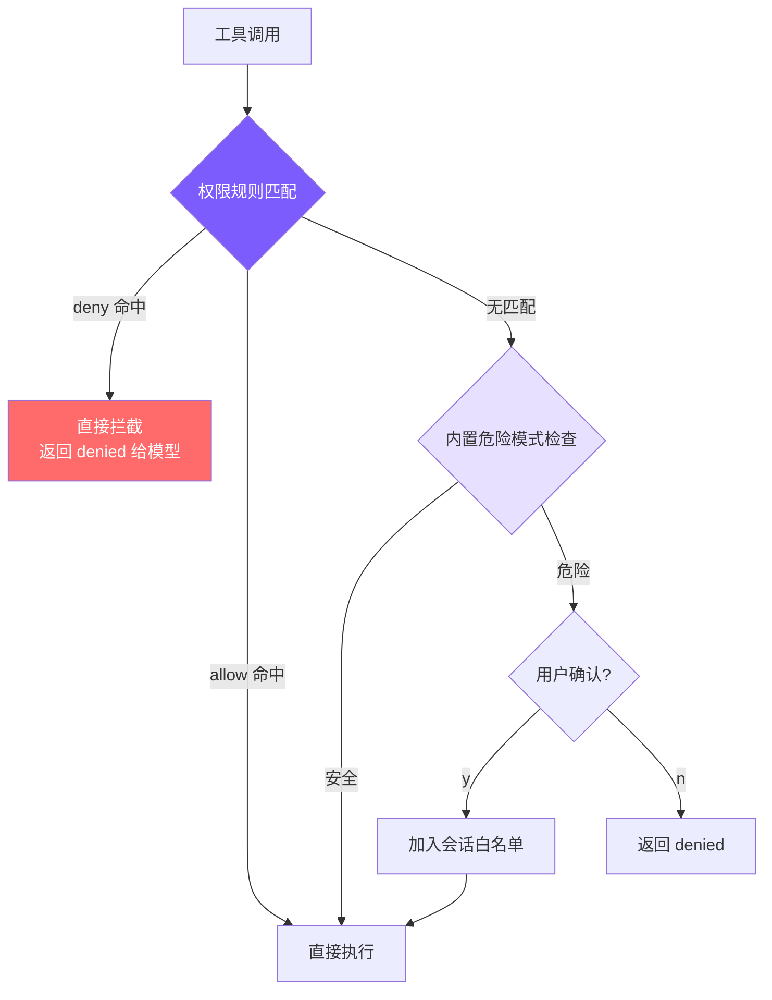

# 10. 权限规则系统

## 本章目标

在第 5 章的基础上，实现**可配置的权限规则系统**：用户通过配置文件预定义 allow/deny 规则，让 agent 自动放行安全操作、自动拦截危险操作，无需每次手动确认。



核心思路：**两层检查，deny 优先**。先查配置文件中的规则（Layer 1），无匹配再走内置危险模式检测（Layer 2）。这把第 5 章的"每次都问"升级为"按规则自动决策"。

## Claude Code 怎么做的

Claude Code 的权限系统是 7 层纵深防御：工作区信任确认、5 种权限模式、allow/deny/ask 规则匹配、tree-sitter AST 静态分析、工具级独立检查、OS 沙箱隔离、交互式确认 + ML 分类器竞速。

核心是 `hasPermissionsToUseToolInner`（52KB 的巨型函数），决策顺序是：**deny 规则 → ask 规则 → 工具自身检查 → bypassPermissions 模式 → allow 规则 → 兜底 ask**。

几个关键设计：

**deny 在最前面**：无论什么权限模式，deny 规则命中就直接拒绝。这保证了管理员规则的绝对效力。

**bypass 在 deny 之后**：bypassPermissions（全自动模式）排在 deny 检查之后，也排在"安全路径检查"（编辑 `.git/`、`.bashrc` 等敏感文件时工具返回的强制确认信号）之后。即使开了 `--yolo`，这些操作仍然会弹确认框。

**工具有自主权**：BashTool 自带 23 项 AST 静态检查，FileEditTool 检查敏感路径，新工具可以携带自己的安全策略接入，不需要修改中央权限逻辑。

**8 种规则来源，严格优先级**：企业 MDM 策略（不可覆盖）> 用户全局 > 项目级（提交到仓库）> 本地项目（不提交）> CLI 参数 > 运行时参数 > 命令定义 > 会话级（点"始终允许"产生）。低优先级不能覆盖高优先级——企业策略 deny 的操作，用户在任何层级写 allow 都无效。

**3 种匹配类型**：精确匹配（`Bash(git status)`）、前缀匹配（`Bash(npm:*)`）、通配符匹配（`Bash(git * --no-verify)`）。通配符以空格+`*` 结尾时尾部可选，与前缀语法行为保持一致。

**ask 规则**是 bypassPermissions 的安全阀——即使全自动模式，`npm publish`、`git push --force` 这类高危操作仍强制人工确认。

确认对话框有三种处理器：CLI 模式下用户确认与 ML 分类器竞速（人类意图优先，有 200ms 防误触宽限），协调器模式下顺序执行避免多 Worker 同时弹框，子 Agent 模式下最保守——直接拒绝未授权操作，不弹框。

## 我们的实现

7 层 → **2 层**，8 种来源 → **2 种**（用户级 + 项目级），3 种行为 → **2 种**（allow + deny）。

### 配置文件格式

```json
// ~/.claude/settings.json（用户级，全局生效）
{
  "permissions": {
    "allow": [
      "read_file",
      "list_files",
      "grep_search",
      "run_shell(npm test*)",
      "run_shell(git status)",
      "run_shell(git diff*)"
    ],
    "deny": [
      "run_shell(rm -rf*)",
      "run_shell(git push --force*)"
    ]
  }
}
```

```json
// .claude/settings.json（项目级，提交到仓库）
{
  "permissions": {
    "allow": ["run_shell(npm run build)"],
    "deny": ["run_shell(curl*)"]
  }
}
```

两个文件的规则合并后一起生效。规则格式：
- `"read_file"` — 匹配该工具的所有调用
- `"run_shell(npm test*)"` — 匹配 `run_shell` 中命令以 `npm test` 开头的调用

## 关键代码

### 1. 规则解析

<!-- tabs:start -->
#### **TypeScript**
```typescript
// tools.ts

interface ParsedRule {
  tool: string;
  pattern: string | null;  // null 表示匹配该工具的所有调用
}

function parseRule(rule: string): ParsedRule {
  const match = rule.match(/^([a-z_]+)\((.+)\)$/);
  if (match) {
    return { tool: match[1], pattern: match[2] };
  }
  return { tool: rule, pattern: null };
}
```
#### **Python**
```python
# tools.py

def _parse_rule(rule: str) -> dict:
    m = re.match(r"^([a-z_]+)\((.+)\)$", rule)
    if m:
        return {"tool": m.group(1), "pattern": m.group(2)}
    return {"tool": rule, "pattern": None}
```
<!-- tabs:end -->

把字符串规则拆成结构化数据。`run_shell(npm test*)` → `{tool: "run_shell", pattern: "npm test*"}`，裸工具名 → `{tool: "read_file", pattern: null}`。

### 2. 加载规则

<!-- tabs:start -->
#### **TypeScript**
```typescript
// tools.ts

let cachedRules: PermissionRules | null = null;

export function loadPermissionRules(): PermissionRules {
  if (cachedRules) return cachedRules;

  const allow: ParsedRule[] = [];
  const deny: ParsedRule[] = [];

  const userSettings = loadSettings(join(homedir(), ".claude", "settings.json"));
  const projectSettings = loadSettings(join(process.cwd(), ".claude", "settings.json"));

  for (const settings of [userSettings, projectSettings]) {
    if (!settings?.permissions) continue;
    if (Array.isArray(settings.permissions.allow)) {
      for (const r of settings.permissions.allow) allow.push(parseRule(r));
    }
    if (Array.isArray(settings.permissions.deny)) {
      for (const r of settings.permissions.deny) deny.push(parseRule(r));
    }
  }

  cachedRules = { allow, deny };
  return cachedRules;
}
```
#### **Python**
```python
# tools.py

_cached_rules: dict | None = None

def load_permission_rules() -> dict:
    global _cached_rules
    if _cached_rules is not None:
        return _cached_rules

    allow: list[dict] = []
    deny: list[dict] = []

    user_settings = _load_settings(Path.home() / ".claude" / "settings.json")
    project_settings = _load_settings(Path.cwd() / ".claude" / "settings.json")

    for settings in [user_settings, project_settings]:
        if not settings or "permissions" not in settings:
            continue
        perms = settings["permissions"]
        for r in perms.get("allow", []):
            allow.append(_parse_rule(r))
        for r in perms.get("deny", []):
            deny.append(_parse_rule(r))

    _cached_rules = {"allow": allow, "deny": deny}
    return _cached_rules
```
<!-- tabs:end -->

两个文件的规则**追加**到同一个数组（不是覆盖），所以用户级和项目级规则并存。结果缓存在内存里——一个会话有几十上百次工具调用，每次都读磁盘没必要。

### 3. 规则匹配

<!-- tabs:start -->
#### **TypeScript**
```typescript
// tools.ts

function matchesRule(
  rule: ParsedRule,
  toolName: string,
  input: Record<string, any>
): boolean {
  if (rule.tool !== toolName) return false;
  if (!rule.pattern) return true;

  let value = "";
  if (toolName === "run_shell") value = input.command || "";
  else if (input.file_path) value = input.file_path;
  else return true;

  const pattern = rule.pattern;
  if (pattern.endsWith("*")) {
    return value.startsWith(pattern.slice(0, -1));
  }
  return value === pattern;
}
```
#### **Python**
```python
# tools.py

def _matches_rule(rule: dict, tool_name: str, inp: dict) -> bool:
    if rule["tool"] != tool_name:
        return False
    if rule["pattern"] is None:
        return True

    value = ""
    if tool_name == "run_shell":
        value = inp.get("command", "")
    elif "file_path" in inp:
        value = inp["file_path"]
    else:
        return True

    pattern = rule["pattern"]
    if pattern.endswith("*"):
        return value.startswith(pattern[:-1])
    return value == pattern
```
<!-- tabs:end -->

三层判断：工具名不匹配直接跳过 → 无 pattern 则工具名匹配即可 → 有 pattern 则取 `command` 或 `file_path` 做匹配。支持两种匹配方式：尾部 `*` 做前缀匹配，否则精确匹配。

注意：`run_shell(np*)` 会同时匹配 `npm` 和 `npx`，写规则时注意前缀精确度。

### 4. 规则检查：deny 优先

<!-- tabs:start -->
#### **TypeScript**
```typescript
// tools.ts

function checkPermissionRules(
  toolName: string,
  input: Record<string, any>
): "allow" | "deny" | null {
  const rules = loadPermissionRules();

  for (const rule of rules.deny) {
    if (matchesRule(rule, toolName, input)) return "deny";
  }
  for (const rule of rules.allow) {
    if (matchesRule(rule, toolName, input)) return "allow";
  }
  return null;
}
```
#### **Python**
```python
# tools.py

def _check_permission_rules(tool_name: str, inp: dict) -> str | None:
    rules = load_permission_rules()

    for rule in rules["deny"]:
        if _matches_rule(rule, tool_name, inp):
            return "deny"
    for rule in rules["allow"]:
        if _matches_rule(rule, tool_name, inp):
            return "allow"
    return None
```
<!-- tabs:end -->

返回值是三态：`"allow"` / `"deny"` / `null`（无意见，交给下一层）。

deny 先于 allow 遍历，所以即使你写了 `allow: ["run_shell"]`，`deny: ["run_shell(rm -rf*)"]` 仍然生效——"先放开，再收紧"的规则写法因此成立。

### 5. 统一入口

<!-- tabs:start -->
#### **TypeScript**
```typescript
// tools.ts

export function checkPermission(
  toolName: string,
  input: Record<string, any>
): { action: "allow" | "deny" | "confirm"; message?: string } {
  // Layer 1: 配置文件规则
  const ruleResult = checkPermissionRules(toolName, input);
  if (ruleResult === "deny") {
    return { action: "deny", message: `Denied by permission rule for ${toolName}` };
  }
  if (ruleResult === "allow") {
    return { action: "allow" };
  }

  // Layer 2: 内置危险模式检查
  if (toolName === "run_shell" && isDangerous(input.command)) {
    return { action: "confirm", message: input.command };
  }
  if (toolName === "write_file" && !existsSync(input.file_path)) {
    return { action: "confirm", message: `write new file: ${input.file_path}` };
  }
  if (toolName === "edit_file" && !existsSync(input.file_path)) {
    return { action: "confirm", message: `edit non-existent file: ${input.file_path}` };
  }

  return { action: "allow" };
}
```
#### **Python**
```python
# tools.py

def check_permission(
    tool_name: str,
    inp: dict,
    mode: str = "default",
    plan_file_path: str | None = None,
) -> dict:
    """Returns {"action": "allow"|"deny"|"confirm", "message": ...}"""
    if mode == "bypassPermissions":
        return {"action": "allow"}

    # Layer 1: 配置文件规则
    rule_result = _check_permission_rules(tool_name, inp)
    if rule_result == "deny":
        return {"action": "deny", "message": f"Denied by permission rule for {tool_name}"}
    if rule_result == "allow":
        return {"action": "allow"}

    # Layer 2: 内置危险模式检查
    if tool_name == "run_shell" and is_dangerous(inp.get("command", "")):
        return {"action": "confirm", "message": inp.get("command", "")}
    if tool_name == "write_file" and not Path(inp.get("file_path", "")).exists():
        return {"action": "confirm", "message": f"write new file: {inp.get('file_path', '')}"}
    if tool_name == "edit_file" and not Path(inp.get("file_path", "")).exists():
        return {"action": "confirm", "message": f"edit non-existent file: {inp.get('file_path', '')}"}

    return {"action": "allow"}
```
<!-- tabs:end -->

Layer 1 无意见才进 Layer 2，两层都没拦住就默认允许。三种动作：`allow` 直接执行，`deny` 直接拦截，`confirm` 弹确认框。

Python 版多了 `mode` 参数，`bypassPermissions` 时跳过全部检查（不像 Claude Code 还有 bypass-immune，我们的 `--yolo` 就是真的跳过一切）。

### 6. Agent Loop 集成

<!-- tabs:start -->
#### **TypeScript**
```typescript
// agent.ts

const perm = checkPermission(toolUse.name, input, this.permissionMode);

if (perm.action === "deny") {
  printInfo(`Denied: ${perm.message}`);
  toolResults.push({
    type: "tool_result",
    tool_use_id: toolUse.id,
    content: `Action denied by permission rules: ${perm.message}`,
  });
  continue;
}

if (perm.action === "confirm" && perm.message
    && !this.confirmedPaths.has(perm.message)) {
  const confirmed = await this.confirmDangerous(perm.message);
  if (!confirmed) {
    toolResults.push({
      type: "tool_result",
      tool_use_id: toolUse.id,
      content: "User denied this action.",
    });
    continue;
  }
  this.confirmedPaths.add(perm.message);
}
```
#### **Python**
```python
# agent.py

perm = check_permission(tu.name, inp, self.permission_mode, self._plan_file_path)

if perm["action"] == "deny":
    print_info(f"Denied: {perm.get('message', '')}")
    tool_results.append({
        "type": "tool_result",
        "tool_use_id": tu.id,
        "content": f"Action denied: {perm.get('message', '')}",
    })
    continue

if perm["action"] == "confirm" and perm.get("message") and perm["message"] not in self._confirmed_paths:
    confirmed = await self._confirm_dangerous(perm["message"])
    if not confirmed:
        tool_results.append({
            "type": "tool_result",
            "tool_use_id": tu.id,
            "content": "User denied this action.",
        })
        continue
    self._confirmed_paths.add(perm["message"])
```
<!-- tabs:end -->

deny 不弹对话框，直接把拒绝消息作为工具结果返回给模型——模型看到 "Action denied by permission rules" 后会调整策略。confirm 走会话白名单（`confirmedPaths`），用户确认一次后同一操作不再重复询问。

## 关键设计决策

| 维度 | Claude Code | mini-claude |
|------|------------|-------------|
| 防御层数 | 7 层 | 2 层 |
| 规则来源 | 8 种，严格优先级 | 2 种，合并 |
| 规则行为 | allow / deny / ask | allow / deny |
| 匹配方式 | 精确 / 前缀 / 通配符 | 精确 / 尾部通配符 |
| 命令分析 | tree-sitter AST | 正则匹配 |
| Bypass-Immune | 敏感路径强制确认 | 无 |

**为什么 deny 优先于 allow**：这是安全系统的标准设计。allow 优先的话，一旦你写了 `allow: ["run_shell"]` 就没法用 deny 排除危险子命令了。deny 优先让"先放开，再收紧"的配置方式成为可能：

```json
{
  "permissions": {
    "allow": ["run_shell(git *)"],
    "deny": ["run_shell(git push --force*)"]
  }
}
```

**为什么没有 ask 规则**：Claude Code 的 ask 是给 bypassPermissions 设安全阀用的。我们的 `--yolo` 语义是"完全信任"，加 ask 规则反而矛盾。需要强制确认的操作，不加入 allow 列表就行——自然落到 Layer 2 的内置检查。

---

> **这一章为第 5 章的安全机制增加了可配置性**。从"写死的规则"到"用户定义规则"，是从个人工具迈向团队工具的关键一步。Claude Code 的 7 层体系告诉我们上限在哪里，2 层实现告诉我们下限可以多简单。
